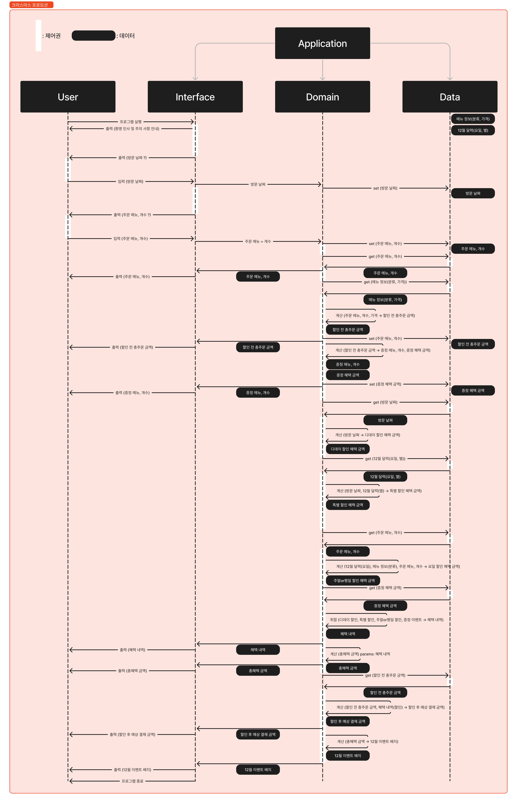
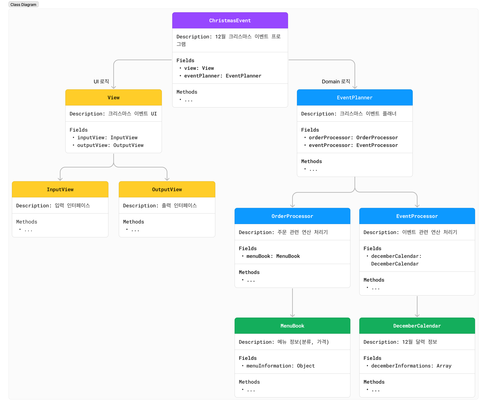

# 4주 차 미션: 크리스마스 프로모션

## 미션 목표

- [x] **객체(클래스)**
  - [x] **객체(클래스)를 분리하는 연습을 한다.**
    - 클래스의 **역할과 책임**을 생각해 보기
    - 클래스 작성 시 **도메인 로직에 집중**하는 방향으로 구현
    - **UI는 도메인 로직과 분리**하는 방향으로 생각
  - [x] **객체의 상태에 대한 외부의 접근을 최소화한다.**
    - 이유: 객체를 **자율적인 존재**로 만들기 위함
      - 객체지향의 핵심은 스스로 상태를 관리하고 판단하고 행동하는 **자율적인 객체**들의 공동체를 구성하는 것임. 자율적인 존재가 되기 위해서 **외부의 간섭을 최소화** 해야함. 외부에서는 객체가 어떤 상태에 놓여 있는지, 어떤 생각을 하고 있는지 알아서는 안되며, 결정에 직접적으로 개입해서도 안됨. 객체에게 원하는 것을 요청하고 객체가 스스로 최선의 방법을 결정하는 것을 믿고 기다려야 함
  - [x] **객체를 객체스럽게 사용한다.**
    - 객체로부터 데이터를 꺼내는 것(get)이 아니라, 메시지를 던지도록 구조를 바꿔 **데이터를 가지는 개체가 일하도록** 해야함
  - [x] **필드의 수를 최소화한다.**
    - 필드의 수가 많은 것은 객체의 복잡도를 높임
    - **필드에 중복**이 있는지, **불필요한 필드**가 없는지 확인
- [ ] **테스트**
  - [ ] **예외에 대한 케이스도 테스트한다.**
    - 프로그램에서 결함이 자주 발생하는 부분 중 하나는 **경계값**이므로 이 부분을 특히 꼼꼼하게 확인해야 함
  - [ ] **테스트 코드도 코드다.**
    - **리팩토링**을 통해 개선해 나가야 함. 특히 반복적인 부분을 **중복되지 않도록** 만들어야 함
  - [ ] **테스트를 위한 코드는 코드에 분리되어야 한다.**
    - 테스트를 통과하기 위한 편의 메서드를 구현 코드에 구현하지 않아야 함
    - 테스트를 위해 구현 코드를 변경하거나 테스트에서만 사용되는 로직을 만들지 않아야 함
  - [ ] **테스트가 어려운 것은 클래스 외부로 분리한다.**
    - 단위 테스트 내부에 테스트하기 어려운 부분이 포함되어 있다면, 해당 부분을 **외부로 분리**하는 시도를 하여, 테스트하기 어려운 부분은 테스트 하지 않고 테스트 가능한 부분을 테스트 함

---

## 프로세스

1. 애플리케이션 실행
2. 환영 인사 및 주의 사항 안내 멘트 출력
   - 총 주문 금액 10,000원 이상부터 이벤트 적용
   - 음료만 주문 불가능
   - 메뉴 최대 20개까지만 주문 가능
3. 방문 날짜 입력 및 저장
4. 주문 메뉴와 개수 입력 및 저장
5. 주문 내역 및 이벤트 혜택 내역 계산
   - 주문 메뉴 및 개수
   - 할인 전 총 주문 금액
     - (각 주문 메뉴 가격 \* 개수) 계산 후 더하기
   - 증정 메뉴
     - 총 주문 금액 12만원 이상 주문 시, 샴폐인 1개 증정
   - 혜택 내역
     - 방문 날짜, 요일 기반 할인 혜택
       - 날짜
         - 크리스마스 디데이 할인 (12.01 ~ 12.25)
         - 특별 할인 (12.01 ~ 12.31)
       - 요일
         - 평일 할인 (12.01 ~ 12.31)
         - 주말 할인 (12.01 ~ 12.31)
     - 총 주문 금액 기반 증정 이벤트
       - 12만원 이상 주문 시, 샴폐인 1개 증정 (12.01 ~ 12.31)
   - 총 혜택 금액
   - 할인 후 예상 결제 금액
     - 할인 전 총
   - 12월 이벤트 배지
     - 총 혜택 금액 기반 배지 부여
       - 5,000원 이상: 별
       - 10,000원 이상: 트리
       - 20,000원 이상: 산타
6. 주문 내역 및 이벤트 혜택 내역 출력
7. 애플리케이션 종료

---

## Sequence Diagram

---

## Class Diagram

## 핵심 기능

**방문 날짜, 주문 메뉴를 기반으로 주문 내역, 이벤트 혜택 내역 계산**

---

## 기능 목록

### UI

#### InputView

- [x] 방문 날짜 입력
  - [x] 검사: 빈 값 입력 불가능
  - [x] 검사: 1 ~ 31 숫자만 입력 가능
- [x] 주문 메뉴 및 개수 입력
  - [x] 검사: 빈 값 입력 불가능
  - [x] 검사: `메뉴명-개수,메뉴명-개수,...` 포맷만 입력 가능
  - [x] 검사: 중복된 메뉴명 입력 불가능
  - [x] 검사: 1 미만의 개수 입력 불가능

#### OutputView

- [x] 환영 인사 및 주의 사항 안내 멘트 출력
- [x] 이벤트 미리보기 멘트 출력
- [x] 주문 메뉴 출력
- [x] 할인 전 총주문 금액 출력
- [x] 증정 메뉴 출력
- [x] 혜택 내역 출력
- [x] 총혜택 금액 출력
- [x] 할인 후 예상 결제 금액 출력
- [x] 12월 이벤트 배지 출력
- [x] 에러 메시지 출력

### Domain

#### EventPlanner

- [x] 할인 후 예상 결제 금액 계산
- [x] 12월 이벤트 배지 계산

#### OrderProcessor

- [x] 검사: 메뉴북에 있는 메뉴만 주문 가능
- [x] 검사: 음료만 주문 불가능
- [x] 검사: 메뉴 최대 20개까지만 주문 가능
- [x] 주문 내역 계산
- [x] 할인 전 총주문 금액 계산

#### EventProcessor

- [x] 이벤트 혜택 계산 및 취합
  - [x] 확인: 총 주문 금액 10,000원 이상부터 이벤트 적용
  - [x] 증정 이벤트
    - ex: `{ 이벤트종류: 증정, 메뉴: 샴페인, 개수: 1, 혜택금액: 25000 }`
  - [x] 크리스마스 디데이 할인
    - ex: `{ 이벤트종류: 할인, 할인종류: 크리스마스디데이할인  혜택금액: 2500 }`
  - [x] 특별 할인
    - ex: `{ 이벤트종류: 할인, 할인종류: 특별할인  혜택금액: 1000 }`
  - [x] 평일 할인
    - ex: `{ 이벤트종류: 할인, 할인종류: 평일할인  혜택금액: 2023 }`
  - [x] 주말 할인
    - ex: `{ 이벤트종류: 할인, 할인종류: 주말할인  헤택금액: 2023 }`
- [x] 총혜택 금액 계산
- [x] 총할인혜택 금액 계산

---
